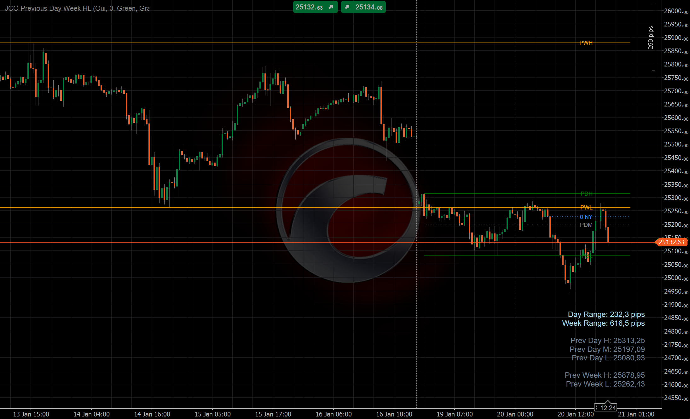

# JCO Previous Day & Week High Low Indicator

A cTrader indicator that displays Previous Day High/Low/Mid levels, Previous Week High/Low levels, and the NY Midnight opening price line.

## Features

- **Previous Day Levels**: High, Low, and Mid (50%) lines with customizable colors
- **Previous Week Levels**: High and Low lines
- **NY Midnight Line**: Opening price at New York midnight (00:00 EST)
- **Labels**: Configurable labels on all lines (PDH, PDM, PDL, PWH, PWL, 0 NY)
- **Dashboard**: Price ranges and levels displayed on the chart
- **Visibility Toggles**: Show/hide each group independently
- **Vertical Lines**: Optional markers for day/week boundaries

## Parameters

### Previous Day
| Parameter | Default | Description |
|-----------|---------|-------------|
| Show Day Lines | true | Toggle visibility of day lines |
| Starting Hour | 0 | Hour (UTC) to start the day calculation |
| High Line Color | Green | Color for the high line |
| Mid Line Color | Gray | Color for the mid line |
| Low Line Color | Green | Color for the low line |
| Show Mid Line | true | Toggle mid line visibility |
| Line Thickness | 2 | Thickness of the lines |
| Extend Lines (Candles) | 10 | Number of candles to extend lines |
| Vertical Line Color | Blue | Color for vertical day markers |
| Label Font Size | 9 | Font size for labels |

### Previous Week
| Parameter | Default | Description |
|-----------|---------|-------------|
| Show Week Lines | true | Toggle visibility of week lines |
| High Line Color | Orange | Color for the high line |
| Low Line Color | Orange | Color for the low line |
| Line Thickness | 2 | Thickness of the lines |
| Extend Lines (Candles) | 10 | Number of candles to extend lines |
| Vertical Line Color | DarkOrange | Color for vertical week markers |
| Label Font Size | 9 | Font size for labels |

### NY Midnight
| Parameter | Default | Description |
|-----------|---------|-------------|
| Show NY Midnight Line | true | Toggle visibility of midnight line |
| Line Color | DodgerBlue | Color for the line |
| Line Thickness | 2 | Thickness of the line |
| Line Style | DotsRare | Style of the line |
| Extend Lines (Candles) | 10 | Number of candles to extend line |
| Label Font Size | 9 | Font size for label |

### Display
| Parameter | Default | Description |
|-----------|---------|-------------|
| Show Vertical Lines | true | Toggle vertical boundary markers |
| Display Dashboard | true | Toggle price dashboard |
| Enable Print | false | Enable debug output |

## Installation

1. Download the `.cs` file
2. Open cTrader
3. Go to **Automate** > **Indicators**
4. Click **New Indicator** or import the file
5. Build and add to your chart

## License

MIT License

## Author

J. Cornier

## Links

- [GitHub Repository](https://github.com/jcornierfra/cTrader-Indicator-JCO-Previous-Day-Week-HL)
